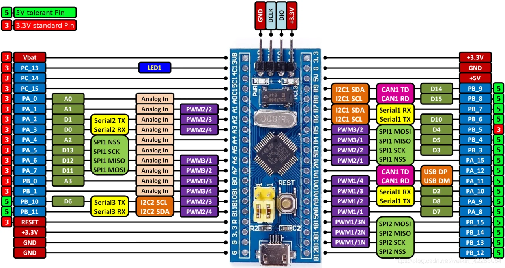

# 🚀 C_Embebido_Stm32f103C8T6
Repositorio enfocado a practicar conceptos teóricos de programación en C embebido utilizando la tarjeta de desarrollo STM32F103C8T6 Blue Pill.

[💬 Comunicación UART](https://github.com/Drinuxbydrx/C_Embebido_Stm32f103C8T6/blob/main/comunicacion_uart.md)

[💬 GPIO General Purpose Input/Output, o Entrada/Salida de Propósito General](https://github.com/Drinuxbydrx/C_Embebido_Stm32f103C8T6/blob/main/gpio.md)

[💬 Protocolo de comunicacion I2C]()

[💬 SPI]()

[💬 Registros de memoria]()

[💬 ADC]()

[💬 DMA]()

[💬 NVIC]()

[💬 Timmers]()

[💬 DMA]()

[💬 System Tick Timmer]()

