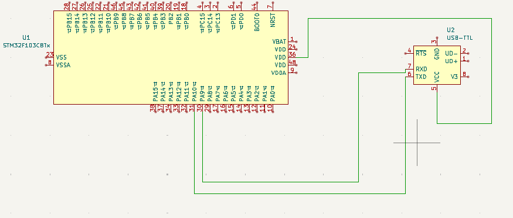
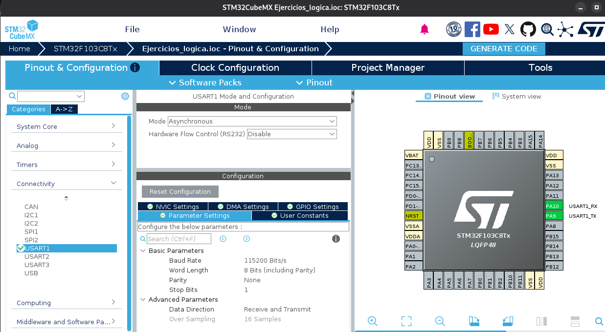
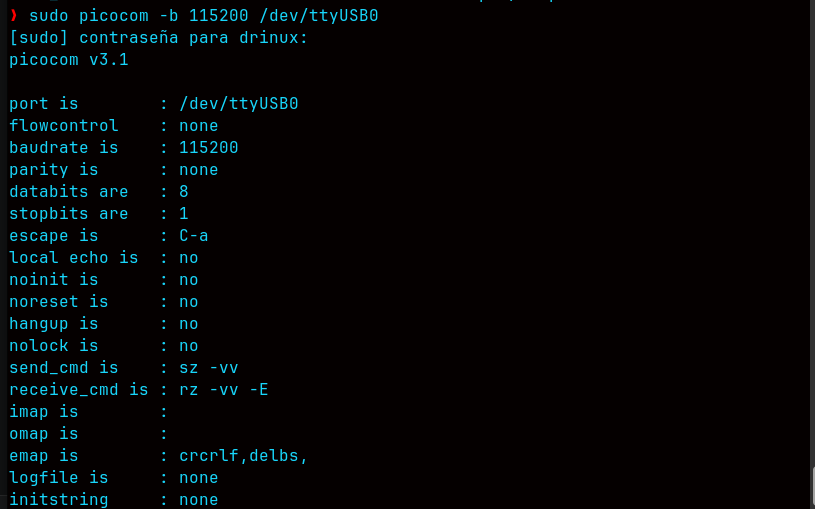
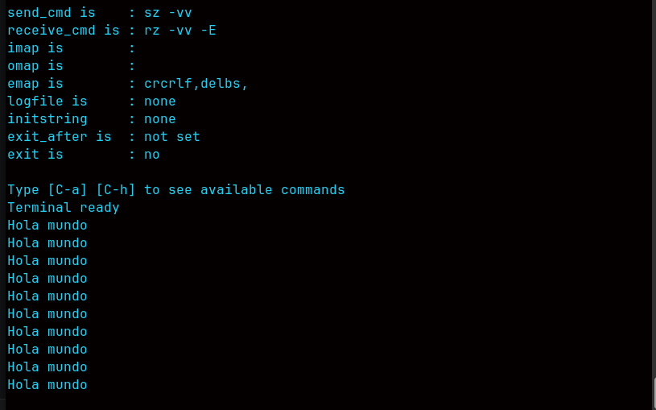
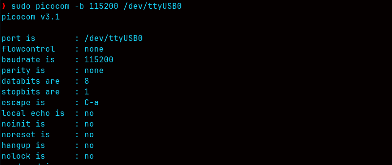
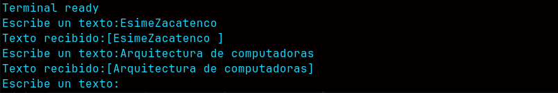

# Qué es UART?
UART (Universal Asynchronous Receiver-Transmitter) es un periférico de hardware que convierte datos en una secuencia serial de bits. Esto lo realiza mediante un pin como emisor y otro pin como receptor, estableciendo una comunicación bidireccional.

En esta comunicación bidireccional, lo primordial es la asincronía, ya que no existe una señal de reloj compartida (a diferencia de los protocolos SPI e I2C). Por ende, se debe establecer una velocidad a la cual se va a realizar tanto la emisión como la recepción; a esto se le llama baud rate (bits por segundo, típicamente 9600 o 115200).

### Conexión UART a STM32F103C8T6

TX : transmisión<br> RX : recepción.<br>Su conexión siempre es de forma cruzada:<br>

TX del STM32 → RX del adaptador USB-TTL<br>
RX del STM32 → TX del adaptador USB-TTL<br>
GND del STM32 → GND del adaptador <br>



### Configuración en STMCUBE MX

Damos clic en Connectivity, seleccionamos USART1 y en Mode cambiamos a Asynchronous. Se observa claramente que por defecto nos habilita PA9 y PA10, y en Baud rate dejamos por defecto la velocidad de 115200 Bits/s.



Y aquí damos clic en Generar código, lo que nos genera una estructura como esta:

```c

#include "main.h"

UART_HandleTypeDef huart1;

void SystemClock_Config(void);
static void MX_GPIO_Init(void);
static void MX_USART1_UART_Init(void);

int main(void)
{
  HAL_Init();
  SystemClock_Config();
  MX_GPIO_Init();
  MX_USART1_UART_Init();

  while (1)
  {

  }

}


void SystemClock_Config(void)
{
  RCC_OscInitTypeDef RCC_OscInitStruct = {0};
  RCC_ClkInitTypeDef RCC_ClkInitStruct = {0};

  RCC_OscInitStruct.OscillatorType = RCC_OSCILLATORTYPE_HSI;
  RCC_OscInitStruct.HSIState = RCC_HSI_ON;
  RCC_OscInitStruct.HSICalibrationValue = RCC_HSICALIBRATION_DEFAULT;
  RCC_OscInitStruct.PLL.PLLState = RCC_PLL_NONE;
  if (HAL_RCC_OscConfig(&RCC_OscInitStruct) != HAL_OK)
  {
    Error_Handler();
  }

  RCC_ClkInitStruct.ClockType = RCC_CLOCKTYPE_HCLK|RCC_CLOCKTYPE_SYSCLK
                              |RCC_CLOCKTYPE_PCLK1|RCC_CLOCKTYPE_PCLK2;
  RCC_ClkInitStruct.SYSCLKSource = RCC_SYSCLKSOURCE_HSI;
  RCC_ClkInitStruct.AHBCLKDivider = RCC_SYSCLK_DIV1;
  RCC_ClkInitStruct.APB1CLKDivider = RCC_HCLK_DIV1;
  RCC_ClkInitStruct.APB2CLKDivider = RCC_HCLK_DIV1;

  if (HAL_RCC_ClockConfig(&RCC_ClkInitStruct, FLASH_LATENCY_0) != HAL_OK)
  {
    Error_Handler();
  }
}


static void MX_USART1_UART_Init(void)
{
  huart1.Instance = USART1;
  huart1.Init.BaudRate = 115200;
  huart1.Init.WordLength = UART_WORDLENGTH_8B;
  huart1.Init.StopBits = UART_STOPBITS_1;
  huart1.Init.Parity = UART_PARITY_NONE;
  huart1.Init.Mode = UART_MODE_TX_RX;
  huart1.Init.HwFlowCtl = UART_HWCONTROL_NONE;
  huart1.Init.OverSampling = UART_OVERSAMPLING_16;
  if (HAL_UART_Init(&huart1) != HAL_OK)
  {
    Error_Handler();
  }

}


static void MX_GPIO_Init(void)
{
  __HAL_RCC_GPIOA_CLK_ENABLE();
}
void Error_Handler(void)
{

  __disable_irq();
  while (1)
  {
  }

}
#ifdef USE_FULL_ASSERT

void assert_failed(uint8_t *file, uint32_t line)
{

}
#endif
``` 
Para codificar nuestro primer **Hola mundo** vamos a configurar nuestra terminal con la misma velocidad de Baude rate que habiamos configurado **115200**



Sintaxis general para transmitir texto via UART


``` c++
HAL_StatusTypeDef HAL_UART_Transmit(UART_HandleTypeDef *huart, const uint8_t *pData, uint16_t Size, uint32_t Timeout);

Donde :

UART_HandleTypeDef *huart : es el puntero a nuestra configuracion que realizamos UART.
const uint8_t *pData : es el puntero a el arreglo del buffer donde se almacena nuestro mensaje.
uint16_t Size : Cantidad total de bytes a enviar. El -1 se utiliza para indicar que es una 
cadena de texto envuelta entre comillas.Si se desea enviar diferente tipo de informacion que no este envuelta enre comillas. 

uint8_t datos[] = {0x01, 0x02, 0x03, 0x04};

HAL_UART_Transmit(&huart1, datos, sizeof(datos), 100);

uint32_t Timeout : Tiempo máximo de espera en milisegundos (ms) para completar el envío.

```
Funcion principal mensaje hola mundo
``` c++
void mensajeholamundo(void){
	uint8_t mensaje[]="Hola mundo sistemas embebidos\r\n";
	HAL_UART_Transmit(&huart1,mensaje,sizeof(mensaje) -1,100);
	HAL_Delay(1000);
}
``` 

[Click para ver el codigo Hola Mundo](https://github.com/Drinuxbydrx/C_Embebido_Stm32f103C8T6/blob/main/Hola_Mundo_Comunicacion_Uart/hola_mundo/Core/Src/main.c)

y finalmente tenemos nuestro hola mundo corriendo en la placa stm32f103c8t6.


Ahora ya que pudimos integrar un mensaje desde consola vamos a obtener los datos de igual forma con comunicacion UART a traves de la consola para esto integramos la siguiente funcion 

``` c++
void UART_Leertexto(char *buffer,uint16_t max_longitud){
	uint16_t id = 0;
	uint8_t caracter = 0;
	memset(buffer,0,max_longitud);
	while(id<max_longitud -1){
		detecciontexto=HAL_UART_Receive(&huart1,&caracter,1,10000);
		if(detecciontexto == HAL_OK){
			HAL_UART_Transmit(&huart1,&caracter,1,10);
			if(caracter=='\r'||caracter=='\n'){
				break;
			}
			buffer[id++]=(char) caracter;
		}
	}
            buffer[id]='\0';
}
```
[Click para ver el codigo Leer Texto Consola UART](https://github.com/Drinuxbydrx/C_Embebido_Stm32f103C8T6/blob/main/Leer_entradas_por_consola_UART/LeerTextoConsolaUART/Core/Src/main.c)

lo cargamos al microcontrolador y ejecutamos la consola con nuestro comando

```bash
sudo picocom -b 115200 /dev/ttyUSB0
```


y ejecutamos nuestro codigo y obtenemos la siguiente salida en consola


