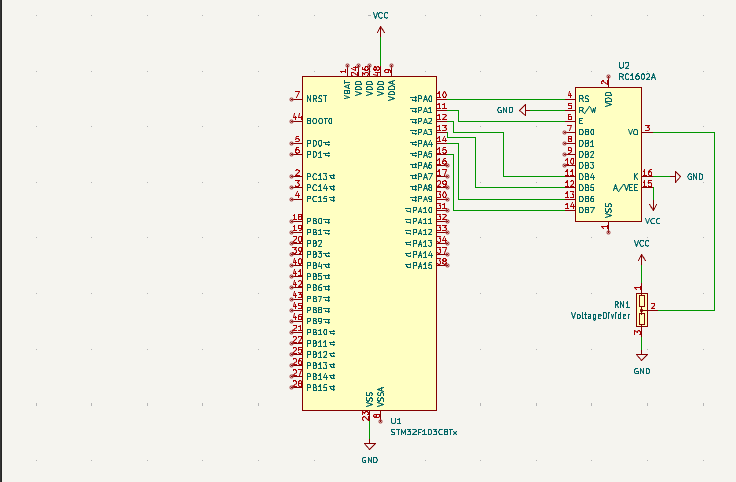
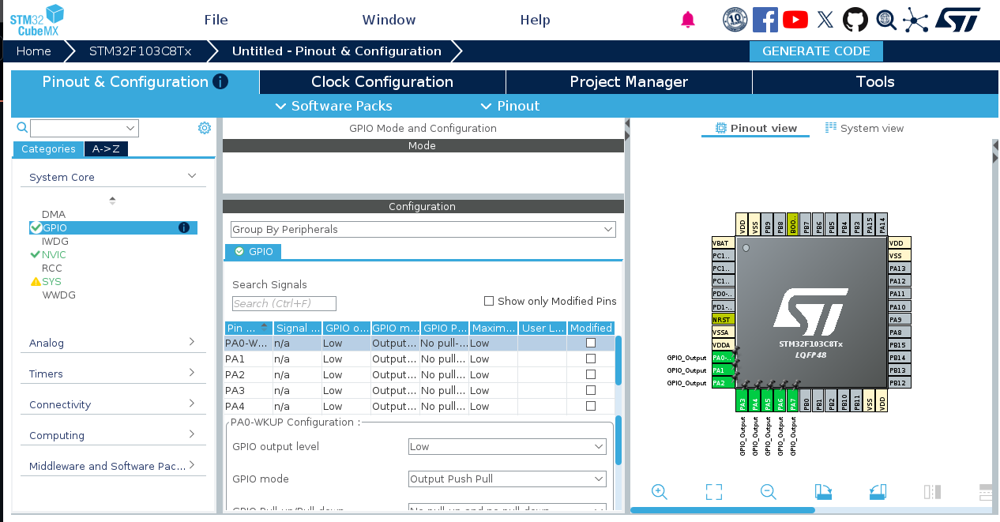
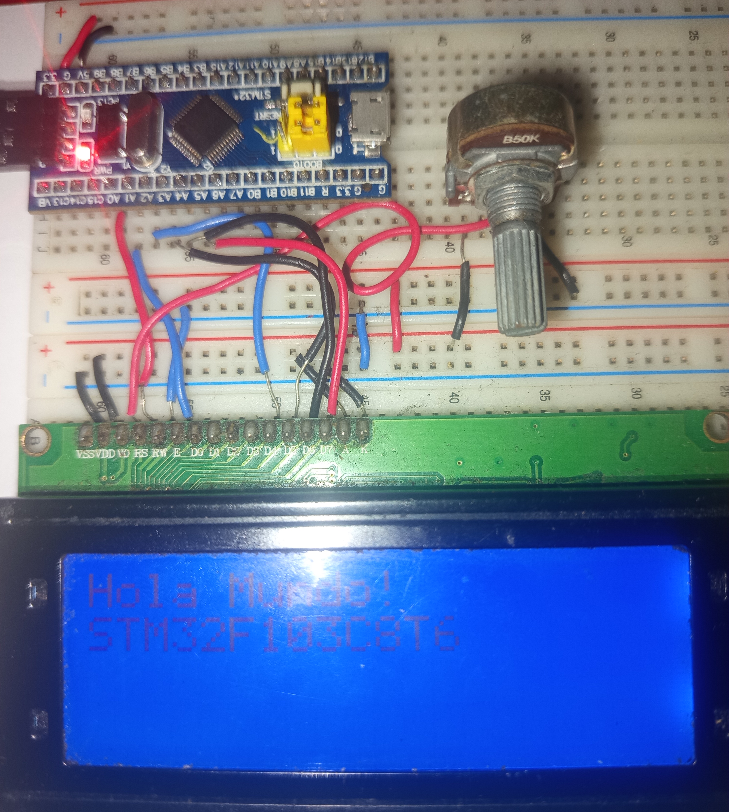

# GPIO 

GPIO General Purpose Input/Output. Es un pin del microcontrolador que tú puedes configurar por software para que se comporte como:

* Entrada digital
* Salida digital 
* Entrada analógica 

### Pull-up y Pull-down

Un pull-up conecta el pin a VCC (3.3V) mediante una resistencia
Un pull-down conecta a GND

¿Por qué se necesitan?

Las entradas digitales son muy sensibles al ruido electromagnético. Si se dejan en estado flotante, esta interferencia puede provocar lecturas falsas y afectar el funcionamiento del circuito. Por esta razón, se utilizan resistencias pull-up o pull-down, las cuales fijan un estado lógico definido y resuelven este problema.

### Sintaxis General

```c++
GPIO_PinState HAL_GPIO_ReadPin(GPIO_TypeDef* GPIOx, uint16_t GPIO_Pin);

Donde :

GPIO_TypeDef* GPIOx: Puntero correspondiente al pin que se haya configurado GPIOA, GPIOB, GPIOC.
GPIO_Pin : Especifica que pin quiere leer GPIO_PIN_0, GPIO_PIN_1


HAL_GPIO_WritePin(GPIO_TypeDef* GPIOx, uint16_t GPIO_Pin, GPIO_PinState PinState);

GPIO_TypeDef* GPIOx: Puntero correspondiente al pin que se haya configurado GPIOA, GPIOB, GPIOC.
GPIO_Pin : Especifica que pin que se desea escribir GPIO_PIN_0, GPIO_PIN_1.
GPIO_PinState PinState: Define el estado a escribir.
```
### Otras funciones

Función | Descripción | Ejemplo de Sintaxis |
| :--- | :--- | :--- |
| **`HAL_GPIO_TogglePin`** | Invierte el estado actual del pin (si estaba en `HIGH` pasa a `LOW` y viceversa). | `HAL_GPIO_TogglePin(GPIOC, GPIO_PIN_13);` |
| **`HAL_GPIO_LockPin`** | Bloquea la configuración del pin hasta el siguiente reinicio del microcontrolador (MCU). | `HAL_GPIO_LockPin(GPIOA, GPIO_PIN_0);` |
| **`HAL_GPIO_Init`** | Configura las propiedades del pin (Modo, Pull-Up/Down, Velocidad) según una estructura `GPIO_InitTypeDef`. | `HAL_GPIO_Init(GPIOA, &GPIO_InitStruct);` |
| **`HAL_GPIO_DeInit`** | Desconfigura un pin y lo regresa a su estado por defecto tras el reset. | `HAL_GPIO_DeInit(GPIOA, GPIO_PIN_0);` |

### Esquematico Conexiones entre Pantalla Lcd y STM32F103C8T6
Esquematico de las conexiones entre la pantalla LCD y el microcontrolador cabe mencionar que estas conexiones se pueden aplicar a LCD 16*2 y 16*4


### Configuración GPIO de placa de desarrollo STM32F103C8T6

Seleccionamos **System Core** y nos dirigimos al paratado de GPIO y dentro de nuestro diagrama que nos muestra seleccionamos los pines A0,A1,A2,A3,A4,A5,A6,A7 y los seleccionamos como salidas.



Dentro de la programacion entre la pantalla lcd y el microcontrolador existes 5 funciones principales 

```c++
void LCD_EnablePulse(void);
void LCD_SendNibble(uint8_t nibble);
void LCD_SendByte(uint8_t data, uint8_t isDataMode);
void LCD_Init(void);
void LCD_SendString(char *str);

Donde :

void LCD_EnablePulse(void):es el reloj de sincronización (latch) del controlador de la pantalla LCD (HD44780).
void LCD_SendNibble(uint8_t nibble):Funcion principal para enviar cadenas de 4 bits.
void LCD_SendByte(uint8_t data, uint8_t isDataMode):Funcion para enviar bytes que seria 2 nibbles.
void LCD_Init(void):Funcion para iniciar la configuracion principal del LCD.
void LCD_SendString(char *str):Funcion para enviar el texto a la pantalla LCD.
```

[Codigo de pantalla LCD]()

Al ejecutarlo obtenemos una salida como esta en nuestra pantalla LCD
