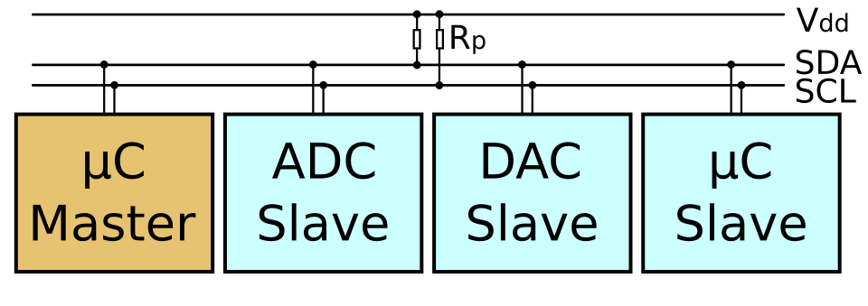
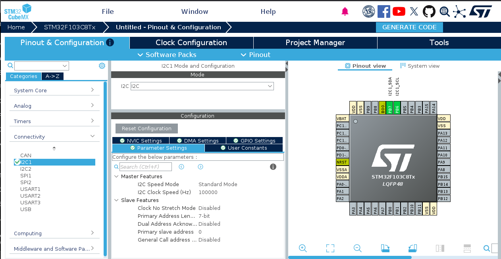
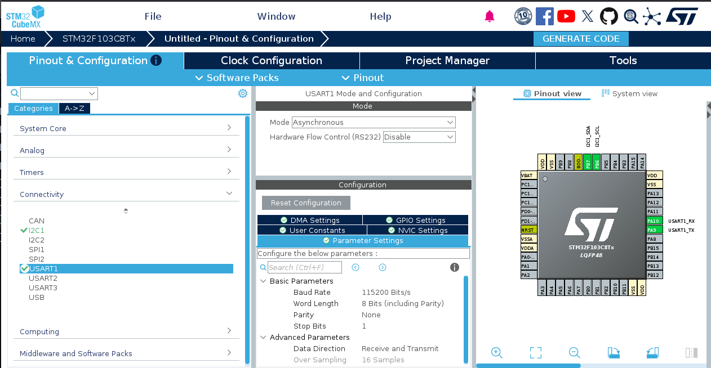
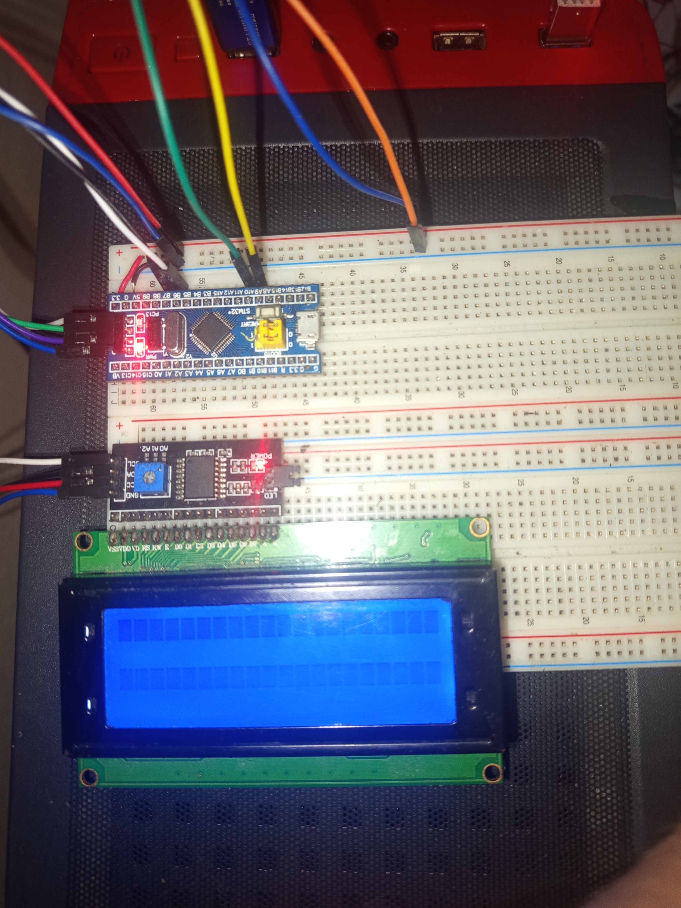
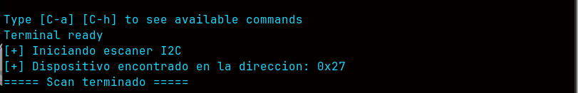

# Protocolo i2C 

Significa Inter-Integrated Circuit.El I²C precisa de dos líneas de señal: reloj **SCL**, Serial Clock y la línea de datos **SDA**, Serial Data.

* SDA = datos
* SCL = sincronización

```bash
SCL:  _|‾|_|‾|_|‾|_|‾|_

SDA:  __|‾‾|__|‾|____|‾
```
se utiliza dentro de :

* sensores
* EEPROM
* RTC
* ADC 
* DAC

```bash
            I²C BUS
                │
        ┌───────┴────────┐
        │                │
      Sensor           EEPROM
        │                │
        └───────┬────────┘
                │
              STM32
```

### Maestro Esclavo
La transferencia de datos es siempre inicializada por un maestro el esclavo reacciona.

El maestro decide:

* cuando comienza
* cuando termina
* que dispositivo contactar
* cuando generar el reloj
* si quiere leer
* si quiere escribir

El esclavo es el despositivo que responde 



### Dirección 

I2C puede controlar o saber a que dispositivo hay que enviar informacion a traves de Direcciones de memoria: 


```bash
Sensor → 0x48
EEPROM → 0x50
LCD    → 0x27
```

### ¿Por qué las líneas necesitan resistencias?

En la mayoría de los pines digitales estándar, el microcontrolador conmuta activamente el pin entre VCC y GND .

Si dos componentes conectados a la misma línea intentaran hablar al mismo tiempo y uno pusiera la línea en HIGH mientras el otro la pone en LOW, se crearía una ruta directa de muy baja resistencia entre VCC y GND. Esto provocaría un cortocircuito, quemando los pines de los microcontroladores.

La solución de I2C:

Para evitar cortocircuitos con múltiples dispositivos en el mismo bus, I2C impone una regla estricta: ningún dispositivo puede inyectar voltaje activo a la línea.

Para enviar un 0: El transistor interno del chip se cierra y conecta la línea a tierra. El chip fuerza activamente el estado bajo.

Para enviar un 1: El transistor interno se abre y desconecta el chip de la línea queda en alta impedancia o "flotando". El chip suministra voltaje.


### Configuración para practica de Scanner I2C

Seleccionamos el apartado Connectivity e ingresamos a I2C1. En la opción Mode, elegimos I2C y mantenemos la configuración por defecto.



Para este escáner de bus requerimos comunicación UART. Para ello, seleccionamos USART1 y configuramos los siguientes parámetros:

* Mode: Asynchronous
* Baud Rate: 115200 Bits/s


[💬 Codigo Scanner protocolo de comunicacion I2C](https://github.com/Drinuxbydrx/C_Embebido_Stm32f103C8T6/blob/main/Pantalla_LCD_comunicacion_I2C/Scanner_de_diecciones_I2C/Core/Src/main.c)


### Conexiones Fisicas.



### Respuesta en consola

Ejecutamos el comando **picocom** para recibir via uart la respuesta

```bash
sudo picocom -b 115200 /dev/ttyUSB0
```

